# Define Paths to clinical metadata files, HistoTME prediction files, IHC Validation files, output directory

replace existing paths to those saved on your computer. The clinical
metadata files, HistoTME prediction files and IHC Validation files can
be found on [zenodo](10.5281/zenodo.11490460)

``` r
CLINICAL_METADATA_PATH = "~/Tamara_ICB_response/SUNY_FINAL_clinical_data_with_PFS_corrected_050224.tsv"
HISTOTME_SUNY_NSCLC = "~/Tamara_ICB_response/suny_predictions_multitask_UNI.csv"
HISTOTME_CPTAC_NSCLC = "~/Tamara_ICB_response/cptac_predictions_multitask_UNI.csv"
HISTOTME_TCGA_NSCLC = "~/Tamara_ICB_response/TCGA_predictions_multitask_UNI.csv"
CD8_QUPATH_MEASUREMENTS = "~/SUNY_CD4_CD8/SUNY_cd8_tcell_qupath_measurements.csv"
CD4_QUPATH_MEASUREMENTS = "~/SUNY_CD4_CD8/SUNY_cd4_tcell_qupath_measurements.csv"
BCELL_QUPATH_MEASUREMENTS = "~/SUNY_CD3_CD20/SUNY_bcell_qupath_measurements_v2.csv"
MAC_QUPATH_MEASUREMENTS = "~/SUNY_P40_CD163/SUNY_mac_qupath_measurements.csv"
OUTPUT_DIR = "~/Tamara_ICB_response"
```

# Load required R libraries and packages

``` r
library(readr)
library(readxl)
library(survival)
library(survminer)
```

    ## Loading required package: ggplot2

    ## Loading required package: ggpubr

    ## 
    ## Attaching package: 'survminer'

    ## The following object is masked from 'package:survival':
    ## 
    ##     myeloma

``` r
library(caret)
```

    ## Loading required package: lattice

    ## 
    ## Attaching package: 'caret'

    ## The following object is masked from 'package:survival':
    ## 
    ##     cluster

``` r
library(ConsensusClusterPlus)
library(ComplexHeatmap)
```

    ## Loading required package: grid

    ## ========================================
    ## ComplexHeatmap version 2.14.0
    ## Bioconductor page: http://bioconductor.org/packages/ComplexHeatmap/
    ## Github page: https://github.com/jokergoo/ComplexHeatmap
    ## Documentation: http://jokergoo.github.io/ComplexHeatmap-reference
    ## 
    ## If you use it in published research, please cite either one:
    ## - Gu, Z. Complex Heatmap Visualization. iMeta 2022.
    ## - Gu, Z. Complex heatmaps reveal patterns and correlations in multidimensional 
    ##     genomic data. Bioinformatics 2016.
    ## 
    ## 
    ## The new InteractiveComplexHeatmap package can directly export static 
    ## complex heatmaps into an interactive Shiny app with zero effort. Have a try!
    ## 
    ## This message can be suppressed by:
    ##   suppressPackageStartupMessages(library(ComplexHeatmap))
    ## ========================================

``` r
library(factoextra)
```

    ## Welcome! Want to learn more? See two factoextra-related books at https://goo.gl/ve3WBa

``` r
library(cluster)
library(ggplot2)
library(pROC)
```

    ## Type 'citation("pROC")' for a citation.

    ## 
    ## Attaching package: 'pROC'

    ## The following objects are masked from 'package:stats':
    ## 
    ##     cov, smooth, var

``` r
library(epiR)
```

    ## Package epiR 2.0.65 is loaded

    ## Type help(epi.about) for summary information

    ## Type browseVignettes(package = 'epiR') to learn how to use epiR for applied epidemiological analyses

    ## 

# Read clinical metadata and HistoTME signature predictions

``` r
clindat <- read_delim(CLINICAL_METADATA_PATH,delim = "\t")
```

    ## Rows: 692 Columns: 154
    ## ── Column specification ────────────────────────────────────────────────────────
    ## Delimiter: "\t"
    ## chr  (95): case_id, sex, race, family_ca_degree, CCI, smoking_hx, #_LDCT_pri...
    ## dbl  (32): age_at_dx, BMI, ALK_fusion, EGFR_mutations, KRAS_mutation, ROS1, ...
    ## lgl   (2): io_neoadj, other _neoadj
    ## date (25): most_recent_ldct_scan_date, dx_date, neoadj_start, neoadj_end, ma...
    ## 
    ## ℹ Use `spec()` to retrieve the full column specification for this data.
    ## ℹ Specify the column types or set `show_col_types = FALSE` to quiet this message.

``` r
clindat <- clindat[!duplicated(clindat$case_id),]
suny_predictions <- read_csv(HISTOTME_SUNY_NSCLC)
```

    ## Rows: 654 Columns: 31
    ## ── Column specification ────────────────────────────────────────────────────────
    ## Delimiter: ","
    ## chr  (1): ID
    ## dbl (30): MHCI, MHCII, Coactivation_molecules, Effector_cells, T_cells, T_ce...
    ## 
    ## ℹ Use `spec()` to retrieve the full column specification for this data.
    ## ℹ Specify the column types or set `show_col_types = FALSE` to quiet this message.

``` r
tcga_predictions <- read_csv(HISTOTME_TCGA_NSCLC)
```

    ## Rows: 865 Columns: 31
    ## ── Column specification ────────────────────────────────────────────────────────
    ## Delimiter: ","
    ## chr  (1): ID
    ## dbl (30): MHCI, MHCII, Coactivation_molecules, Effector_cells, T_cells, T_ce...
    ## 
    ## ℹ Use `spec()` to retrieve the full column specification for this data.
    ## ℹ Specify the column types or set `show_col_types = FALSE` to quiet this message.

``` r
cptac_predictions <- read_csv(HISTOTME_CPTAC_NSCLC)
```

    ## Rows: 333 Columns: 31
    ## ── Column specification ────────────────────────────────────────────────────────
    ## Delimiter: ","
    ## chr  (1): ID
    ## dbl (30): MHCI, MHCII, Coactivation_molecules, Effector_cells, T_cells, T_ce...
    ## 
    ## ℹ Use `spec()` to retrieve the full column specification for this data.
    ## ℹ Specify the column types or set `show_col_types = FALSE` to quiet this message.

# Unsupervised Analysis: Perform k-means clustering of TCGA+CPTAC data and build classification model based on cluster labels

``` r
# merge HistoTME predictions from TCGA and CPTAC datasets
cptac_predictions <- as.data.frame(cptac_predictions)
cptac_exp <- cptac_predictions[,2:(ncol(cptac_predictions))]
cptac_exp <- apply(as.matrix(cptac_exp),2,scale)
rownames(cptac_exp) <- cptac_predictions$ID
tcga_predictions <- as.data.frame(tcga_predictions)
tcga_exp <- tcga_predictions[,2:(ncol(tcga_predictions))]
tcga_exp <- apply(as.matrix(tcga_exp),2,scale)
rownames(tcga_exp) <- tcga_predictions$ID
mat <- rbind(tcga_exp,cptac_exp)

# evaluate K means clustering metrics for different choices of K
res = ConsensusClusterPlus(d = t(mat), distance = "euclidean", clusterAlg = "km", pItem = 0.8, pFeature = 1, seed = 42,maxK = 6, reps = 100)
```

    ## end fraction

    ## clustered

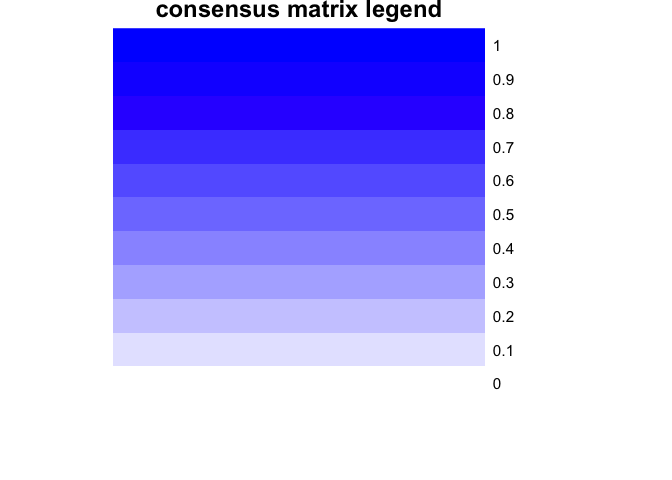

    ## clustered

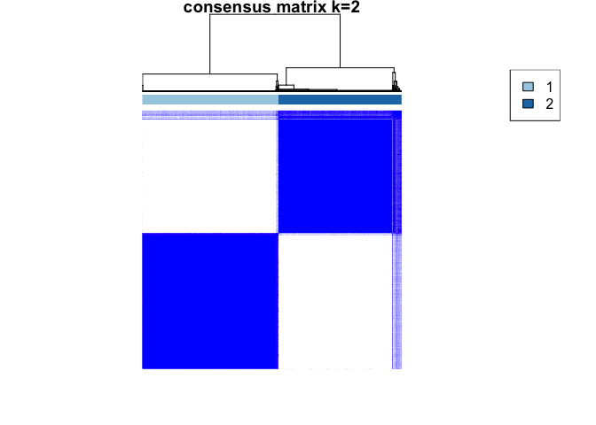

    ## clustered

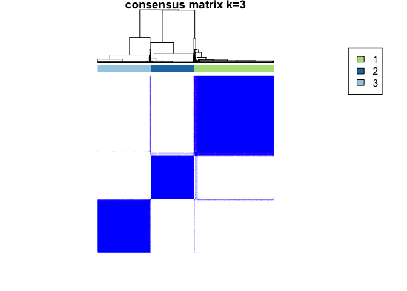

    ## clustered

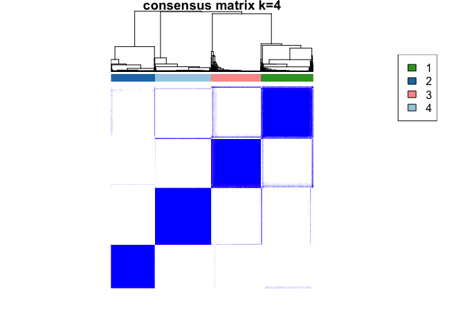

    ## clustered

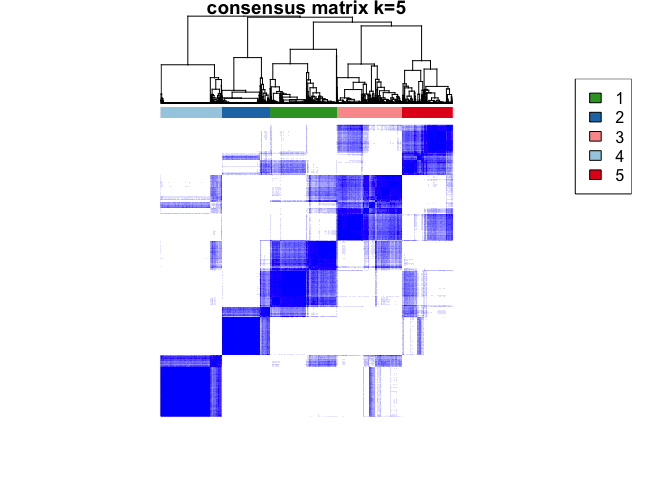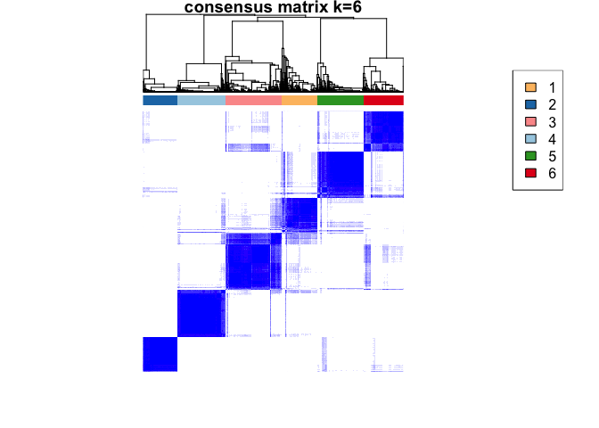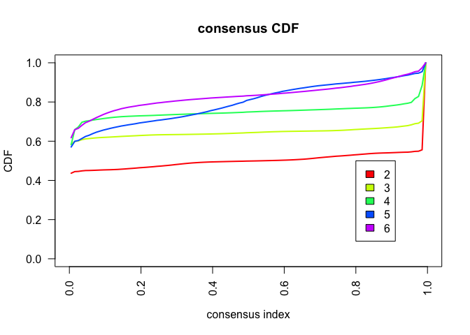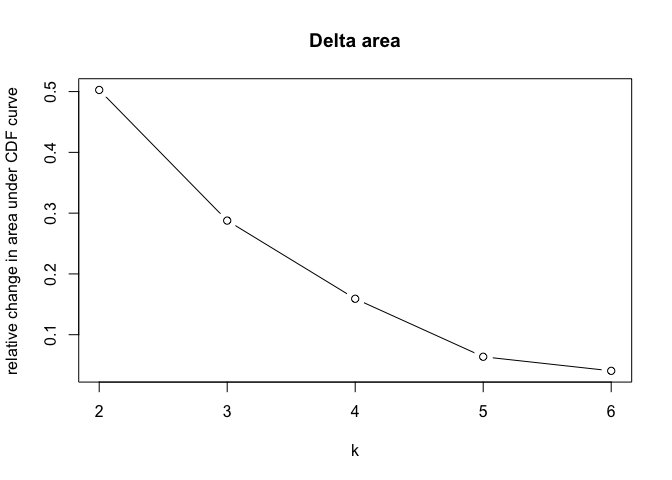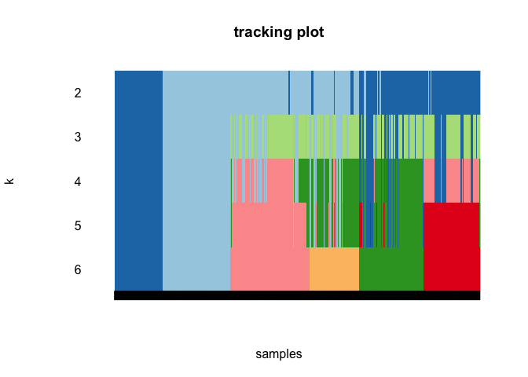

``` r
fviz_nbclust(mat, kmeans, method = "silhouette")
```

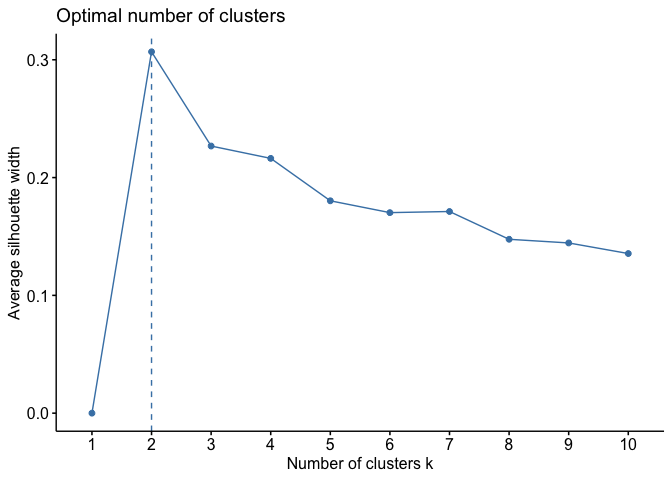

``` r
pdf(paste(OUTPUT_DIR,"Kmeans_Silhouette_scores.pdf",sep = "/"))
fviz_nbclust(mat, kmeans, method = "silhouette")
dev.off()
```

    ## quartz_off_screen 
    ##                 2

``` r
# Perform PCA
pca_result <- prcomp(mat, scale. = TRUE)
pc_scores <- as.data.frame(pca_result$x)
pc_scores$Cluster <- (c("Immune-Desert","Immune-Inflammed")[as.numeric(as.character(res[[2]]$consensusClass) == "2")+1])

# Plot PCA using ggplot2
# Create ggplot object for 3D PCA
pca_plot <- ggplot(pc_scores, aes(x = PC1, y = PC2, color = Cluster)) +
  geom_point(size = 3, alpha = 0.8) +
  labs(title = "PCA",
       x = "Principal Component 1",
       y = "Principal Component 2",
       color = "Cluster") +
  scale_color_manual(values = c( "#88CCEE","#882255")) +
  theme_minimal() +
  theme(plot.title = element_text(size = 16, face = "bold"),
        axis.title = element_text(size = 14),
        legend.title = element_text(size = 12),
        legend.text = element_text(size = 10))

print(pca_plot)
```

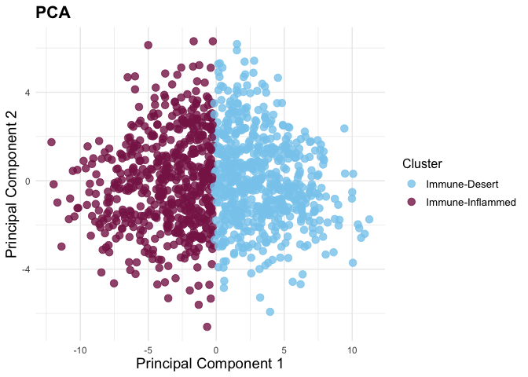

``` r
# Train a random-forest classifier to predict cluster membership
set.seed(42)
control <- trainControl(method = "cv", number=5,)
df <- data.frame((mat), clus = factor(as.character(res[[2]]$consensusClass)))
model <- suppressWarnings(train(clus ~ ., data = df, "rf", trainControl = control))

# Plot feature importances
fimp <- varImp(model)$importance
fimp_plot <- ggplot(data = data.frame(Feature = factor(rownames(fimp), levels = rownames(fimp)[order(fimp$Overall, decreasing = T)]), Importance = fimp$Overall), aes(x = Feature, y = Importance)) + geom_bar(stat = "identity") + theme_minimal() + theme(text = element_text(angle = 90, size = 15)) + xlab("")
print(fimp_plot)
```

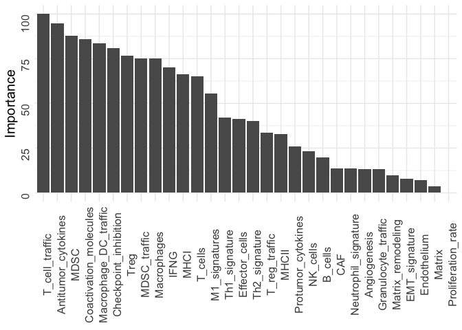

``` r
ggsave(plot = fimp_plot, filename = paste(OUTPUT_DIR,"fimp_plot.pdf",sep = "/"), width = 10, height = 6)
```

# Classify unseen samples from SUNY based on TME classification model

``` r
suny_predictions <- as.data.frame(suny_predictions)
suny_exp <- suny_predictions[,2:(ncol(suny_predictions))]
suny_exp <- apply(as.matrix(suny_exp),2,scale)
rownames(suny_exp) <- suny_predictions$ID
colnames(suny_exp) <- colnames(suny_predictions)[2:(ncol(suny_predictions))]
preds <- predict(model, suny_exp)
```

# Merge HistoTME predictions and clinical metadata of SUNY patients

``` r
clindat$CCI[clindat$CCI == "≥8"] = "8"
survdat <- data.frame(OS_time = clindat$OS_time, OS_status = clindat$OS_status, DSS_time = clindat$DSS_time, DSS_status = clindat$DSS_status, score = NA, treatment = clindat$io_cohort, stage = clindat$cAJCC, grade = clindat$dx_ca_grade,main_adj = !is.na(clindat$io_main) | !is.na(clindat$io_adj), firstline = !is.na(clindat$io_1L), subtype = clindat$histological_type_at_dx, smoking_hx = clindat$smoking_hx, CCI = scale(as.numeric(clindat$CCI)), age = (as.numeric(clindat$age_at_dx)), sample_type = c("biopsy","resection")[as.numeric(grepl("UR-PDL1-LR",clindat$case_id))+1], PDL1_scores = clindat$PDL1_scores, NL_ratio = scale(as.numeric(clindat$`IO_start_neut-lymph_ratio`)), overall_resp = clindat$overall_resp, PFS_adj_time =  clindat$PFS_adj_time, PFS_adj_status = clindat$PFS_adj_status, PFS_1L_time = clindat$PFS_1L_time, PFS_1L_status = clindat$PFS_1L_status, PFS_2L_time = clindat$PFS_2L_time, PFS_2L_status = clindat$PFS_2L_status, PFS_SL_time = clindat$PFS_SL_time, PFS_SL_status = clindat$PFS_SL_status, io_main = clindat$io_main, io_adj = clindat$io_adj, io_1L = clindat$io_1L, resp_1L = clindat$first_line_resp, tmb = scale(clindat$TMB), io_2L = clindat$io_2L, io_SL = clindat$io_SL, overall_resp_stringent = clindat$overall_resp_stringent, chemo_1L = clindat$chemo_1L, chemo_2L = clindat$chemo_2L, chemo_SL = clindat$chemo_SL, chemo_adj = clindat$chemo_adj, chemo_main = clindat$chemo_main, sex = clindat$sex, race = clindat$race)

survdat$io_main_type <- ""
survdat$io_adj_type <- ""
survdat$io_1L_type <- ""
survdat$io_2L_type <- ""
survdat$io_SL_type <- ""

survdat$io_main_type[!is.na(survdat$io_main) &!is.na(survdat$chemo_main)] <- "io+chemo"
survdat$io_main_type[!is.na(survdat$io_main) & is.na(survdat$chemo_main)] <- "io"
survdat$io_adj_type[!is.na(survdat$io_adj) &!is.na(survdat$chemo_adj)] <- "io+chemo"
survdat$io_adj_type[!is.na(survdat$io_adj) & is.na(survdat$chemo_adj)] <- "io"
survdat$io_1L_type[!is.na(survdat$io_1L) &!is.na(survdat$chemo_1L)] <- "io+chemo"
survdat$io_1L_type[!is.na(survdat$io_1L) & is.na(survdat$chemo_1L)] <- "io"
survdat$io_2L_type[!is.na(survdat$io_2L) &!is.na(survdat$chemo_2L)] <- "io+chemo"
survdat$io_2L_type[!is.na(survdat$io_2L) & is.na(survdat$chemo_2L)] <- "io"
survdat$io_SL_type[!is.na(survdat$io_SL) &!is.na(survdat$chemo_SL)] <- "io+chemo"
survdat$io_SL_type[!is.na(survdat$io_SL) & is.na(survdat$chemo_SL)] <- "io"

site <- clindat$prim_met_res_site
site[is.na(site)] <- clindat$prim_met_bx1_site[is.na(site)]
site[is.na(site)] <- clindat$prim_met_bx2_site[is.na(site)]
survdat$site <- site
survdat$subtype[!(survdat$subtype %in% c("NSCLC_adenoca","NSCLC_sqcc")) & !is.na(survdat$subtype)] <- "other"
rownames(survdat) <- clindat$case_id
survdat <- survdat[rownames(suny_exp),]


survdat$cluster <- preds
survdat$response_group <- strata(c("PD-L1 < 50%","PD-L1 ≥50%")[as.numeric(survdat$PDL1_scores %in% c("≥50%"))+1], c("Immune Desert","Immune Inflamed")[as.numeric(survdat$cluster == "2")+1])
```

# Plot HistoTME predictions for the SUNY cohort

``` r
ha = columnAnnotation(
    site = survdat$site,
    subtype = survdat$subtype,
    grade = survdat$grade,
    stage = survdat$stage,
    specimen_type = survdat$sample_type,
    treatment = c("no io","received io")[as.numeric(survdat$treatment == "received io")+1],
    col = list("site" = c("Primary" = "#009E73", 
                          "Metastatic" =  "#F0E442"),
                          
              "stage" = c("I"="#DF65B0",
                          "II" = "#984EA3",
                          "III" = "#FEE5D9",
                          "IV" = "#FB6A4A"),
               "grade" = c("G1" = "#db6d00", 
                           "G2" = "#924900",
                           "G3" = "#525252",
                           "G4" = "#F2F0F7"),
               "subtype" = c("NSCLC_adenoca" = "#CE1256", "NSCLC_sqcc" =  "#6A51A3", "other" = "#01FFAB"),
              "specimen_type" = c("resection" = "#D95F02", "biopsy" = "#1F78B4"),
              "treatment" = c("received io" = "#F00932","no io" = "#CCFFFF")
    )
)

mat <- suny_exp
rownames(mat) <- NULL
Heatmap(t(mat), row_order = order(varImp(model)$importance[,1], decreasing = T), column_split = preds, cluster_columns= T, cluster_column_slices = FALSE, column_gap = unit(2, "mm"),heatmap_legend_param = list(title = "score"), top_annotation = ha)
```

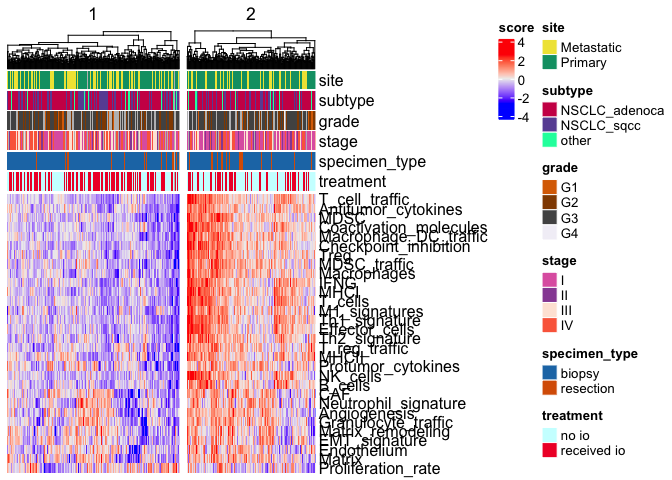

``` r
#pdf(paste(OUTPUT_DIR,"Heatmap_unsupervised_SUNY2.pdf",sep = "/"), width = 16, height = 5)
#Heatmap(t(mat),  row_order = order(varImp(model)$importance[,1], decreasing = T), column_split = preds, cluster_columns= T, cluster_column_slices = FALSE, column_gap = unit(2, "mm"),heatmap_legend_param = list(title = "score"), top_annotation = ha)
#dev.off()
```

# Validate TME class predictions against matched IHC data of resection cases

``` r
tcell_qupath_measurements <- read_csv(CD8_QUPATH_MEASUREMENTS)
```

    ## Rows: 83 Columns: 14
    ## ── Column specification ────────────────────────────────────────────────────────
    ## Delimiter: ","
    ## chr (5): Image, Name, Class, Parent, ROI
    ## dbl (9): Centroid X µm, Centroid Y µm, Num Detections, Num Negative, Num Pos...
    ## 
    ## ℹ Use `spec()` to retrieve the full column specification for this data.
    ## ℹ Specify the column types or set `show_col_types = FALSE` to quiet this message.

``` r
tcell_qupath_measurements2 <- read_csv(CD4_QUPATH_MEASUREMENTS)
```

    ## Rows: 83 Columns: 14
    ## ── Column specification ────────────────────────────────────────────────────────
    ## Delimiter: ","
    ## chr (5): Image, Name, Class, Parent, ROI
    ## dbl (9): Centroid X µm, Centroid Y µm, Num Detections, Num Negative, Num Pos...
    ## 
    ## ℹ Use `spec()` to retrieve the full column specification for this data.
    ## ℹ Specify the column types or set `show_col_types = FALSE` to quiet this message.

``` r
bcell_qupath_measurements <- read_csv(BCELL_QUPATH_MEASUREMENTS)
```

    ## Rows: 83 Columns: 14
    ## ── Column specification ────────────────────────────────────────────────────────
    ## Delimiter: ","
    ## chr (5): Image, Name, Class, Parent, ROI
    ## dbl (9): Centroid X µm, Centroid Y µm, Num Detections, Num Negative, Num Pos...
    ## 
    ## ℹ Use `spec()` to retrieve the full column specification for this data.
    ## ℹ Specify the column types or set `show_col_types = FALSE` to quiet this message.

``` r
mac_qupath_measurements <- read_csv(MAC_QUPATH_MEASUREMENTS)
```

    ## Rows: 83 Columns: 14
    ## ── Column specification ────────────────────────────────────────────────────────
    ## Delimiter: ","
    ## chr (5): Image, Name, Class, Parent, ROI
    ## dbl (9): Centroid X µm, Centroid Y µm, Num Detections, Num Negative, Num Pos...
    ## 
    ## ℹ Use `spec()` to retrieve the full column specification for this data.
    ## ℹ Specify the column types or set `show_col_types = FALSE` to quiet this message.

``` r
cc <- as.character(preds)
names(cc) <- rownames(suny_exp)
dd_clus_tcell <- data.frame(density = (tcell_qupath_measurements$`Num Positive per mm^2` + tcell_qupath_measurements2$`Num Positive per mm^2`), clus = cc[substr(tcell_qupath_measurements$Image,1,14)])
dd_clus_tcell$Image <- tcell_qupath_measurements$Image
dd_clus_tcell <- dd_clus_tcell[!substr(dd_clus_tcell$Image,1,14) %in% c("UR-PDL1-LR-041","UR-PDL1-LR-048","UR-PDL1-LR-083"),]

p1 <- ggplot(data = dd_clus_tcell[!is.na(dd_clus_tcell$clus),], aes(x = clus, y = density)) + geom_boxplot() + theme_bw() + xlab("H&E Predicted cluster") + ylab("CD4+CD8 IHC (num cells/mm^2)") + stat_compare_means()
print(p1)
```

    ## Warning: Removed 1 row containing non-finite outside the scale range
    ## (`stat_boxplot()`).

    ## Warning: Removed 1 row containing non-finite outside the scale range
    ## (`stat_compare_means()`).

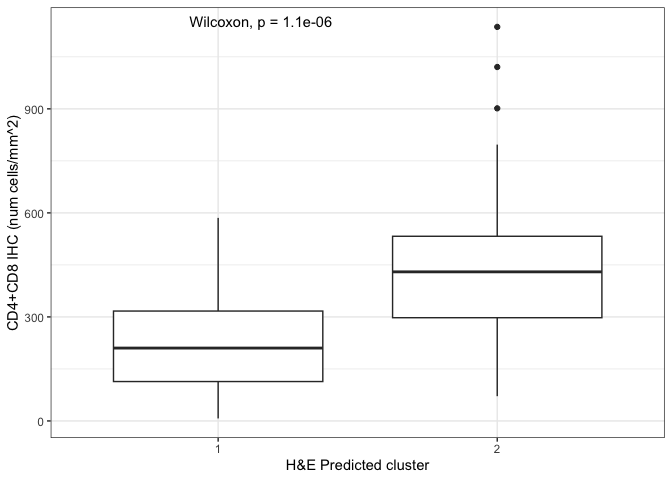

``` r
dd_clus_bcell <- data.frame(density = (bcell_qupath_measurements$`Num Positive per mm^2`), clus = cc[substr(bcell_qupath_measurements$Image,1,14)])
dd_clus_bcell$Image <- bcell_qupath_measurements$Image
dd_clus_bcell <- dd_clus_bcell[!substr(dd_clus_bcell$Image,1,14) %in% c("UR-PDL1-LR-041","UR-PDL1-LR-048","UR-PDL1-LR-083"),]

p2 <- ggplot(data = dd_clus_bcell[!is.na(dd_clus_bcell$clus),], aes(x = clus, y = density)) + geom_boxplot() + theme_bw() + xlab("H&E Predicted cluster") + ylab("CD3+CD20 IHC (num cells/mm^2)") + stat_compare_means()
print(p2)
```

    ## Warning: Removed 1 row containing non-finite outside the scale range (`stat_boxplot()`).
    ## Removed 1 row containing non-finite outside the scale range
    ## (`stat_compare_means()`).

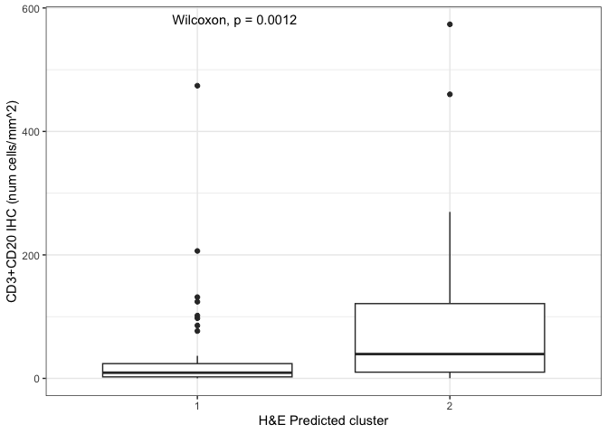

``` r
dd_clus_mac <- data.frame(density = (mac_qupath_measurements$`Num Positive per mm^2`), clus = cc[substr(mac_qupath_measurements$Image,1,14)])
dd_clus_mac$Image <- mac_qupath_measurements$Image
dd_clus_mac <- dd_clus_mac[!substr(dd_clus_mac$Image,1,14) %in% c("UR-PDL1-LR-041","UR-PDL1-LR-048","UR-PDL1-LR-083"),]

p3 <- ggplot(data = dd_clus_mac[!is.na(dd_clus_mac$clus),], aes(x = clus, y = density)) + geom_boxplot() + theme_bw() + xlab("H&E Predicted cluster") + ylab("CD163+P40 IHC (num cells/mm^2)") + stat_compare_means()
print(p3)
```

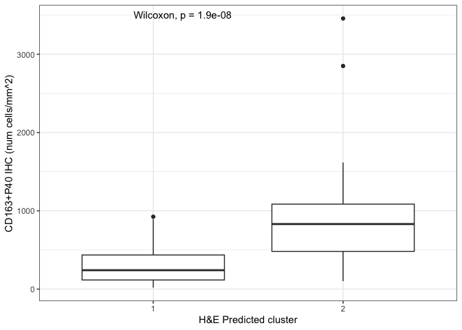

``` r
dd_all <- rbind(dd_clus_tcell,rbind(dd_clus_bcell, dd_clus_mac))
dd_all$cell_type <- c(rep("T cell", nrow(dd_clus_tcell)),rep("B cell", nrow(dd_clus_bcell)),rep("Macrophage", nrow(dd_clus_mac)))
dd_all$cell_type <- factor(dd_all$cell_type, levels = c("T cell","B cell","Macrophage"))

p4 <- ggboxplot(dd_all[!is.na(dd_all$clus),], x = "clus", y="density", facet.by = "cell_type") + theme_bw() + theme(text = element_text(size = 15)) + stat_compare_means(comparisons = list(c("2","1")), method = "wilcox", label = "p.signif") + xlab("AI Prediction") + ylab("# positive cells/mm^2")
print(p4)
```

    ## Warning: Removed 2 rows containing non-finite outside the scale range
    ## (`stat_boxplot()`).

    ## Warning: Removed 2 rows containing non-finite outside the scale range
    ## (`stat_signif()`).

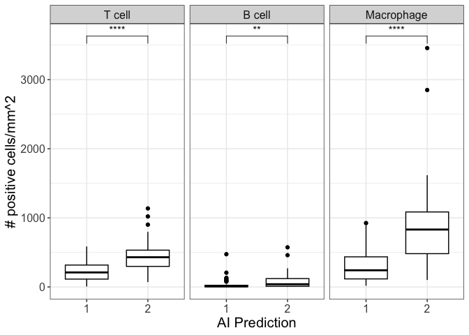

``` r
#ggsave(plot = p4, filename = paste(OUTPUT_DIR,"unsupervised_IHC_validation.pdf"), width = 7, height = 5)
```

# Associations between TME class, PD-L1 scores and overall survival of ICI treated patients

``` r
# Association between TME class and overall survival 
df <- survdat[!is.na(survdat$io_1L),]
surv <- survfit(Surv(OS_time, OS_status) ~ cluster, data = df)
summary(coxph(Surv(OS_time, OS_status) ~ cluster, data = df))
```

    ## Call:
    ## coxph(formula = Surv(OS_time, OS_status) ~ cluster, data = df)
    ## 
    ##   n= 180, number of events= 121 
    ##    (2 observations deleted due to missingness)
    ## 
    ##             coef exp(coef) se(coef)      z Pr(>|z|)   
    ## cluster2 -0.6350    0.5299   0.1995 -3.182  0.00146 **
    ## ---
    ## Signif. codes:  0 '***' 0.001 '**' 0.01 '*' 0.05 '.' 0.1 ' ' 1
    ## 
    ##          exp(coef) exp(-coef) lower .95 upper .95
    ## cluster2    0.5299      1.887    0.3584    0.7836
    ## 
    ## Concordance= 0.577  (se = 0.022 )
    ## Likelihood ratio test= 10.82  on 1 df,   p=0.001
    ## Wald test            = 10.13  on 1 df,   p=0.001
    ## Score (logrank) test = 10.45  on 1 df,   p=0.001

``` r
p1 <- ggsurvplot(surv, data = df,
legend.title = "",
legend = c(0.73, 0.9),
legend.labs=c('Immune Desert', 'Immune Inflamed'),
conf.int = T,
pval = TRUE,
risk.table = TRUE,
tables.height = 0.2,
tables.theme = theme_cleantable(),
risk.table.y.text = FALSE,
pval.coord = c(0, 0.03),
# Color palettes. Use custom color: c("#E7B800", "#2E9FDF"),
# or brewer color (e.g.: "Dark2"), or ggsci color (e.g.: "jco")
palette = c("#88CCEE","#882255","#CC6677", "#7B3294","#7B3254","#885000"),
ggtheme = theme(text = element_text(size = 20)) +theme_bw() # Change ggplot2 theme
) + xlab("Time (days)") + labs(title = "OS First line IO")
A_1L <- p1


# Association between PD-L1 scores and overall survival 
df <- survdat[!is.na(survdat$io_1L),]
surv <- survfit(Surv(OS_time, OS_status) ~ PDL1_scores, data = df)
summary(coxph(Surv(OS_time, OS_status) ~ PDL1_scores, data = df))
```

    ## Call:
    ## coxph(formula = Surv(OS_time, OS_status) ~ PDL1_scores, data = df)
    ## 
    ##   n= 178, number of events= 119 
    ##    (4 observations deleted due to missingness)
    ## 
    ##                     coef exp(coef) se(coef)      z Pr(>|z|)  
    ## PDL1_scores≥50%  -0.4717    0.6239   0.2612 -1.806   0.0709 .
    ## PDL1_scores1-49%  0.2012    1.2228   0.2404  0.837   0.4027  
    ## ---
    ## Signif. codes:  0 '***' 0.001 '**' 0.01 '*' 0.05 '.' 0.1 ' ' 1
    ## 
    ##                  exp(coef) exp(-coef) lower .95 upper .95
    ## PDL1_scores≥50%     0.6239     1.6028    0.3740     1.041
    ## PDL1_scores1-49%    1.2228     0.8178    0.7634     1.959
    ## 
    ## Concordance= 0.575  (se = 0.026 )
    ## Likelihood ratio test= 10.43  on 2 df,   p=0.005
    ## Wald test            = 9.93  on 2 df,   p=0.007
    ## Score (logrank) test = 10.25  on 2 df,   p=0.006

``` r
p1 <- ggsurvplot(surv, data = df,
legend.title = "",
legend = c(0.73, 0.9),
#legend.labs=c('<1%', '1-49%','≥50%'),
conf.int = T,
pval = TRUE,
risk.table = TRUE,
tables.height = 0.2,
tables.theme = theme_cleantable(),
risk.table.y.text = FALSE,
pval.coord = c(0, 0.03),
# Color palettes. Use custom color: c("#E7B800", "#2E9FDF"),
# or brewer color (e.g.: "Dark2"), or ggsci color (e.g.: "jco")
palette = c("#E7298A","#7B3294","#885000","#88CCEE","#882255","#CC6677","#7B3254"),
ggtheme = theme(text = element_text(size = 20)) +theme_bw() # Change ggplot2 theme
) + xlab("Time (days)") + labs(title = "OS First line IO")
B_1L <- p1

# Association between TME class and overall survival in PD-L1 <1% subgroup
df <- survdat[!is.na(survdat$io_1L) & survdat$PDL1_scores %in% c("<1%"),]
surv <- survfit(Surv(OS_time, OS_status) ~ cluster, data = df)
summary(coxph(Surv(OS_time, OS_status) ~ cluster, data = df))
```

    ## Call:
    ## coxph(formula = Surv(OS_time, OS_status) ~ cluster, data = df)
    ## 
    ##   n= 36, number of events= 25 
    ## 
    ##             coef exp(coef) se(coef)      z Pr(>|z|)  
    ## cluster2 -0.9093    0.4028   0.5495 -1.655    0.098 .
    ## ---
    ## Signif. codes:  0 '***' 0.001 '**' 0.01 '*' 0.05 '.' 0.1 ' ' 1
    ## 
    ##          exp(coef) exp(-coef) lower .95 upper .95
    ## cluster2    0.4028      2.483    0.1372     1.183
    ## 
    ## Concordance= 0.602  (se = 0.041 )
    ## Likelihood ratio test= 3.29  on 1 df,   p=0.07
    ## Wald test            = 2.74  on 1 df,   p=0.1
    ## Score (logrank) test = 2.93  on 1 df,   p=0.09

``` r
p1 <- ggsurvplot(surv, data = df,
legend.title = "",
legend = c(0.73, 0.9),
legend.labs=c('Immune Desert', 'Immune Inflamed'),
conf.int = T,
pval = TRUE,
risk.table = TRUE,
tables.height = 0.2,
tables.theme = theme_cleantable(),
risk.table.y.text = FALSE,
pval.coord = c(0, 0.03),
# Color palettes. Use custom color: c("#E7B800", "#2E9FDF"),
# or brewer color (e.g.: "Dark2"), or ggsci color (e.g.: "jco")
palette = c("#88CCEE","#882255","#CC6677", "#7B3294","#7B3254","#885000"),
ggtheme = theme(text = element_text(size = 20)) +theme_bw() # Change ggplot2 theme
) + xlab("Time (days)") + labs(title = "OS First line IO (PDL1 <1%)")
C_1L <- p1


# Association between TME class and overall survival in PD-L1 1-49% subgroup
df <- survdat[!is.na(survdat$io_1L) & survdat$PDL1_scores %in% c("1-49%"),]
surv <- survfit(Surv(OS_time, OS_status) ~ cluster, data = df)
summary(coxph(Surv(OS_time, OS_status) ~ cluster, data = df))
```

    ## Call:
    ## coxph(formula = Surv(OS_time, OS_status) ~ cluster, data = df)
    ## 
    ##   n= 73, number of events= 57 
    ##    (1 observation deleted due to missingness)
    ## 
    ##             coef exp(coef) se(coef)      z Pr(>|z|)  
    ## cluster2 -0.8257    0.4379   0.3243 -2.546   0.0109 *
    ## ---
    ## Signif. codes:  0 '***' 0.001 '**' 0.01 '*' 0.05 '.' 0.1 ' ' 1
    ## 
    ##          exp(coef) exp(-coef) lower .95 upper .95
    ## cluster2    0.4379      2.284    0.2319    0.8269
    ## 
    ## Concordance= 0.586  (se = 0.031 )
    ## Likelihood ratio test= 7.35  on 1 df,   p=0.007
    ## Wald test            = 6.48  on 1 df,   p=0.01
    ## Score (logrank) test = 6.82  on 1 df,   p=0.009

``` r
p1 <- ggsurvplot(surv, data = df,
legend.title = "",
legend = c(0.73, 0.9),
legend.labs=c('Immune Desert', 'Immune Inflamed'),
conf.int = T,
pval = TRUE,
risk.table = TRUE,
tables.height = 0.2,
tables.theme = theme_cleantable(),
risk.table.y.text = FALSE,
pval.coord = c(0, 0.03),
# Color palettes. Use custom color: c("#E7B800", "#2E9FDF"),
# or brewer color (e.g.: "Dark2"), or ggsci color (e.g.: "jco")
palette = c("#88CCEE","#882255","#CC6677", "#7B3294","#7B3254","#885000"),
ggtheme = theme(text = element_text(size = 20)) +theme_bw() # Change ggplot2 theme
) + xlab("Time (days)") + labs(title = "OS First line IO (PDL1 TPS 1-49%)")
D_1L <- p1

# Association between TME class and overall survival in PD-L1 >= 50% subgroup
df <- survdat[!is.na(survdat$io_1L) & survdat$PDL1_scores %in% c("≥50%"),]
surv <- survfit(Surv(OS_time, OS_status) ~ cluster, data = df)
summary(coxph(Surv(OS_time, OS_status) ~ cluster, data = df))
```

    ## Call:
    ## coxph(formula = Surv(OS_time, OS_status) ~ cluster, data = df)
    ## 
    ##   n= 69, number of events= 37 
    ##    (1 observation deleted due to missingness)
    ## 
    ##              coef exp(coef) se(coef)      z Pr(>|z|)
    ## cluster2 -0.06386   0.93814  0.34376 -0.186    0.853
    ## 
    ##          exp(coef) exp(-coef) lower .95 upper .95
    ## cluster2    0.9381      1.066    0.4783      1.84
    ## 
    ## Concordance= 0.505  (se = 0.044 )
    ## Likelihood ratio test= 0.03  on 1 df,   p=0.9
    ## Wald test            = 0.03  on 1 df,   p=0.9
    ## Score (logrank) test = 0.03  on 1 df,   p=0.9

``` r
p1 <- ggsurvplot(surv, data = df,
legend.title = "",
legend = c(0.73, 0.9),
legend.labs=c('Immune Desert', 'Immune Inflamed'),
conf.int = T,
pval = TRUE,
risk.table = TRUE,
tables.height = 0.2,
tables.theme = theme_cleantable(),
risk.table.y.text = FALSE,
pval.coord = c(0, 0.03),
# Color palettes. Use custom color: c("#E7B800", "#2E9FDF"),
# or brewer color (e.g.: "Dark2"), or ggsci color (e.g.: "jco")
palette = c("#88CCEE","#882255","#CC6677", "#7B3294","#7B3254","#885000"),
ggtheme = theme(text = element_text(size = 20)) +theme_bw() # Change ggplot2 theme
) + xlab("Time (days)") + labs(title = "OS First line IO (PDL1 TPS ≥50%)")
E_1L <- p1


#combine all K-M plots into one figure
fig1 <- ggarrange(A_1L$plot,B_1L$plot,A_1L$table, B_1L$table, ncol = 2, nrow = 2,labels = c("A","B"),heights = c(3,1))
fig1_1 <- ggarrange(C_1L$plot, D_1L$plot, E_1L$plot,C_1L$table,D_1L$table,E_1L$table, ncol = 3, nrow = 2, labels = c("C","D","E"), heights = c(3,1))
fig_combined <- ggarrange(fig1,fig1_1, nrow = 2, ncol = 1)
print(fig_combined)
```

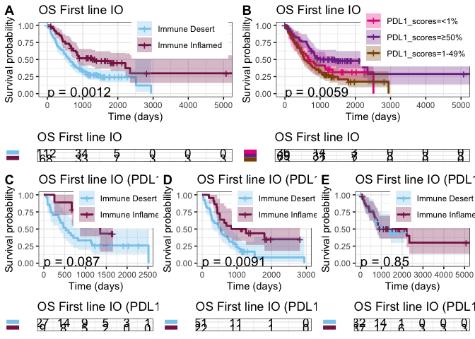

``` r
#ggsave(plot = fig_combined,paste(OUTPUT_DIR,"updated_survival_figure_main.pdf",sep = "/"), width = 16, height = 13)


# Association between TME class and overall survival for patients receiving first line ICI+chemo
df <- survdat[!is.na(survdat$io_1L) & survdat$io_1L_type == "io+chemo",]
surv <- survfit(Surv(OS_time, OS_status) ~ cluster, data = df)
summary(coxph(Surv(OS_time, OS_status) ~ cluster, data = df))
```

    ## Call:
    ## coxph(formula = Surv(OS_time, OS_status) ~ cluster, data = df)
    ## 
    ##   n= 117, number of events= 78 
    ##    (1 observation deleted due to missingness)
    ## 
    ##             coef exp(coef) se(coef)     z Pr(>|z|)   
    ## cluster2 -0.9342    0.3929   0.2840 -3.29    0.001 **
    ## ---
    ## Signif. codes:  0 '***' 0.001 '**' 0.01 '*' 0.05 '.' 0.1 ' ' 1
    ## 
    ##          exp(coef) exp(-coef) lower .95 upper .95
    ## cluster2    0.3929      2.545    0.2252    0.6855
    ## 
    ## Concordance= 0.597  (se = 0.026 )
    ## Likelihood ratio test= 12.64  on 1 df,   p=4e-04
    ## Wald test            = 10.82  on 1 df,   p=0.001
    ## Score (logrank) test = 11.58  on 1 df,   p=7e-04

``` r
p1 <- ggsurvplot(surv, data = df,
legend.title = "",
legend = c(0.73, 0.9),
legend.labs=c('Immune Desert', 'Immune Inflamed'),
conf.int = T,
pval = TRUE,
risk.table = TRUE,
tables.height = 0.2,
tables.theme = theme_cleantable(),
risk.table.y.text = FALSE,
pval.coord = c(0, 0.03),
# Color palettes. Use custom color: c("#E7B800", "#2E9FDF"),
# or brewer color (e.g.: "Dark2"), or ggsci color (e.g.: "jco")
palette = c("#88CCEE","#882255","#CC6677", "#7B3294","#7B3254","#885000"),
ggtheme = theme(text = element_text(size = 20)) +theme_bw() # Change ggplot2 theme
) + xlab("Time (days)") + labs(title = "OS First line IO + Chemo")
AA1 <- p1

# Association between TME class and overall survival for patients receiving first line ICI monotherapy
df <- survdat[!is.na(survdat$io_1L) & survdat$io_1L_type == "io",]
surv <- survfit(Surv(OS_time, OS_status) ~ cluster, data = df)
summary(coxph(Surv(OS_time, OS_status) ~ cluster, data = df))
```

    ## Call:
    ## coxph(formula = Surv(OS_time, OS_status) ~ cluster, data = df)
    ## 
    ##   n= 63, number of events= 43 
    ##    (1 observation deleted due to missingness)
    ## 
    ##             coef exp(coef) se(coef)      z Pr(>|z|)
    ## cluster2 -0.3732    0.6885   0.3094 -1.206    0.228
    ## 
    ##          exp(coef) exp(-coef) lower .95 upper .95
    ## cluster2    0.6885      1.452    0.3755     1.263
    ## 
    ## Concordance= 0.56  (se = 0.04 )
    ## Likelihood ratio test= 1.46  on 1 df,   p=0.2
    ## Wald test            = 1.46  on 1 df,   p=0.2
    ## Score (logrank) test = 1.47  on 1 df,   p=0.2

``` r
p1 <- ggsurvplot(surv, data = df,
legend.title = "",
legend = c(0.73, 0.9),
legend.labs=c('Immune Desert', 'Immune Inflamed'),
conf.int = T,
pval = TRUE,
risk.table = TRUE,
tables.height = 0.2,
tables.theme = theme_cleantable(),
risk.table.y.text = FALSE,
pval.coord = c(0, 0.03),
# Color palettes. Use custom color: c("#E7B800", "#2E9FDF"),
# or brewer color (e.g.: "Dark2"), or ggsci color (e.g.: "jco")
palette = c("#88CCEE","#882255","#CC6677", "#7B3294","#7B3254","#885000"),
ggtheme = theme(text = element_text(size = 20)) +theme_bw() # Change ggplot2 theme
) + xlab("Time (days)") + labs(title = "OS First line IO monotherapy")
AA2 <- p1

# combine all K-M plots into one figure
fig1 <- ggarrange(AA1$plot,AA2$plot,AA1$table, AA2$table, ncol = 2, nrow = 2,labels = c("A","B"),heights = c(3,1))
print(fig1)
```

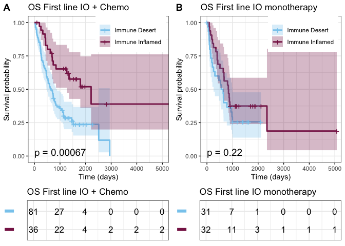

``` r
#ggsave(plot = fig1,paste(OUTPUT_DIR,"survival_figure_treatment_type_1L.pdf",sep = "/"), width = 10, height = 5)


df <- survdat[survdat$treatment == "received io",]
surv <- survfit(Surv(OS_time, OS_status) ~ cluster, data = df)
summary(coxph(Surv(OS_time, OS_status) ~ cluster, data = df))
```

    ## Call:
    ## coxph(formula = Surv(OS_time, OS_status) ~ cluster, data = df)
    ## 
    ##   n= 290, number of events= 197 
    ##    (4 observations deleted due to missingness)
    ## 
    ##             coef exp(coef) se(coef)     z Pr(>|z|)  
    ## cluster2 -0.3537    0.7021   0.1558 -2.27   0.0232 *
    ## ---
    ## Signif. codes:  0 '***' 0.001 '**' 0.01 '*' 0.05 '.' 0.1 ' ' 1
    ## 
    ##          exp(coef) exp(-coef) lower .95 upper .95
    ## cluster2    0.7021      1.424    0.5173    0.9528
    ## 
    ## Concordance= 0.532  (se = 0.019 )
    ## Likelihood ratio test= 5.35  on 1 df,   p=0.02
    ## Wald test            = 5.15  on 1 df,   p=0.02
    ## Score (logrank) test = 5.2  on 1 df,   p=0.02

``` r
p1 <- ggsurvplot(surv, data = df,
legend.title = "",
legend = c(0.73, 0.9),
legend.labs=c('Immune Desert', 'Immune Inflamed'),
conf.int = T,
pval = TRUE,
risk.table = TRUE,
tables.height = 0.2,
tables.theme = theme_cleantable(),
risk.table.y.text = FALSE,
pval.coord = c(0, 0.03),
# Color palettes. Use custom color: c("#E7B800", "#2E9FDF"),
# or brewer color (e.g.: "Dark2"), or ggsci color (e.g.: "jco")
palette = c("#88CCEE","#882255","#CC6677", "#7B3294","#7B3254","#885000"),
ggtheme = theme(text = element_text(size = 15)) +theme_bw() # Change ggplot2 theme
) + xlab("Time (days)") + labs(title = "Overall survival (all IO patients)")
A<- p1


df <- survdat[survdat$treatment == "received io",]
surv <- survfit(Surv(OS_time, OS_status) ~ PDL1_scores, data = df)
summary(coxph(Surv(OS_time, OS_status) ~ PDL1_scores, data = df))
```

    ## Call:
    ## coxph(formula = Surv(OS_time, OS_status) ~ PDL1_scores, data = df)
    ## 
    ##   n= 286, number of events= 195 
    ##    (8 observations deleted due to missingness)
    ## 
    ##                      coef exp(coef) se(coef)      z Pr(>|z|)  
    ## PDL1_scores≥50%  -0.35622   0.70032  0.19795 -1.800   0.0719 .
    ## PDL1_scores1-49% -0.07152   0.93098  0.18259 -0.392   0.6953  
    ## ---
    ## Signif. codes:  0 '***' 0.001 '**' 0.01 '*' 0.05 '.' 0.1 ' ' 1
    ## 
    ##                  exp(coef) exp(-coef) lower .95 upper .95
    ## PDL1_scores≥50%     0.7003      1.428    0.4751     1.032
    ## PDL1_scores1-49%    0.9310      1.074    0.6509     1.332
    ## 
    ## Concordance= 0.537  (se = 0.021 )
    ## Likelihood ratio test= 4.16  on 2 df,   p=0.1
    ## Wald test            = 4.02  on 2 df,   p=0.1
    ## Score (logrank) test = 4.06  on 2 df,   p=0.1

``` r
p1 <- ggsurvplot(surv, data = df,
legend.title = "",
legend = c(0.73, 0.9),
#legend.labs=c('Immune Desert', 'Immune Inflamed'),
conf.int = T,
pval = TRUE,
risk.table = TRUE,
tables.height = 0.2,
tables.theme = theme_cleantable(),
risk.table.y.text = FALSE,
pval.coord = c(0, 0.03),
# Color palettes. Use custom color: c("#E7B800", "#2E9FDF"),
# or brewer color (e.g.: "Dark2"), or ggsci color (e.g.: "jco")
palette = c("#E7298A","#7B3294","#885000","#88CCEE","#882255","#CC6677","#7B3254"),
ggtheme = theme(text = element_text(size = 15)) +theme_bw() # Change ggplot2 theme
) + xlab("Time (days)") + labs(title = "Overall survival (all IO patients)")
B <- p1

# combine all K-M plots into one figure
fig1 <- ggarrange(A$plot,B$plot,A$table, B$table, ncol = 2, nrow = 2,labels = c("A","B"),heights = c(3,1))
print(fig1)
```

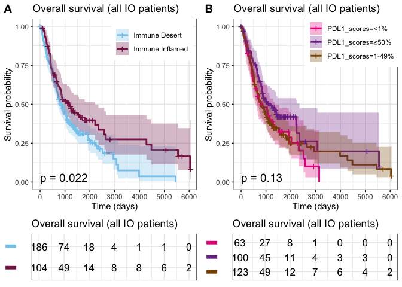

``` r
#ggsave(plot = fig1,paste(OUTPUT_DIR,"updated_survival_figure2.pdf"), width = 14, height = 8)
```

# Associations between TME class, PD-L1 scores and progression free survival of ICI treated patients

``` r
# Association between TME class and progression free survival for patients receiving first line ICI 
df <- survdat[!is.na(survdat$io_1L),]
surv <- survfit(Surv(PFS_1L_time, PFS_1L_status) ~ cluster, data = df)
summary(coxph(Surv(PFS_1L_time, PFS_1L_status) ~ cluster, data = df))
```

    ## Call:
    ## coxph(formula = Surv(PFS_1L_time, PFS_1L_status) ~ cluster, data = df)
    ## 
    ##   n= 181, number of events= 137 
    ##    (1 observation deleted due to missingness)
    ## 
    ##             coef exp(coef) se(coef)      z Pr(>|z|)   
    ## cluster2 -0.5233    0.5925   0.1823 -2.871   0.0041 **
    ## ---
    ## Signif. codes:  0 '***' 0.001 '**' 0.01 '*' 0.05 '.' 0.1 ' ' 1
    ## 
    ##          exp(coef) exp(-coef) lower .95 upper .95
    ## cluster2    0.5925      1.688    0.4145     0.847
    ## 
    ## Concordance= 0.569  (se = 0.021 )
    ## Likelihood ratio test= 8.63  on 1 df,   p=0.003
    ## Wald test            = 8.24  on 1 df,   p=0.004
    ## Score (logrank) test = 8.42  on 1 df,   p=0.004

``` r
p1 <- ggsurvplot(surv, data = df,
legend.title = "",
legend = c(0.73, 0.9),
legend.labs=c('Immune Desert', 'Immune Inflamed'),
conf.int = T,
pval = TRUE,
risk.table = TRUE,
tables.height = 0.2,
tables.theme = theme_cleantable(),
risk.table.y.text = FALSE,
pval.coord = c(0, 0.03),
# Color palettes. Use custom color: c("#E7B800", "#2E9FDF"),
# or brewer color (e.g.: "Dark2"), or ggsci color (e.g.: "jco")
palette = c("#88CCEE","#882255","#CC6677", "#7B3294","#7B3254","#885000"),
ggtheme = theme(text = element_text(size = 15)) +theme_bw() # Change ggplot2 theme
) + xlab("Time (days)") + labs(title = "PFS First line IO")
A_11L <- p1


# Association between PD-L1 scores and progression free survival for patients receiving first line ICI 
df <- survdat[!is.na(survdat$io_1L),]
surv <- survfit(Surv(PFS_1L_time, PFS_1L_status) ~ PDL1_scores, data = df)
summary(coxph(Surv(PFS_1L_time, PFS_1L_status) ~ PDL1_scores, data = df))
```

    ## Call:
    ## coxph(formula = Surv(PFS_1L_time, PFS_1L_status) ~ PDL1_scores, 
    ##     data = df)
    ## 
    ##   n= 179, number of events= 135 
    ##    (3 observations deleted due to missingness)
    ## 
    ##                      coef exp(coef) se(coef)      z Pr(>|z|)  
    ## PDL1_scores≥50%  -0.59511   0.55150  0.23645 -2.517   0.0118 *
    ## PDL1_scores1-49%  0.04173   1.04262  0.22090  0.189   0.8502  
    ## ---
    ## Signif. codes:  0 '***' 0.001 '**' 0.01 '*' 0.05 '.' 0.1 ' ' 1
    ## 
    ##                  exp(coef) exp(-coef) lower .95 upper .95
    ## PDL1_scores≥50%     0.5515     1.8132    0.3470    0.8766
    ## PDL1_scores1-49%    1.0426     0.9591    0.6762    1.6075
    ## 
    ## Concordance= 0.586  (se = 0.024 )
    ## Likelihood ratio test= 11.95  on 2 df,   p=0.003
    ## Wald test            = 11.25  on 2 df,   p=0.004
    ## Score (logrank) test = 11.61  on 2 df,   p=0.003

``` r
p1 <- ggsurvplot(surv, data = df,
legend.title = "",
legend = c(0.73, 0.9),
#legend.labs=c('<1%', '1-49%','≥50%'),
conf.int = T,
pval = TRUE,
risk.table = TRUE,
tables.height = 0.2,
tables.theme = theme_cleantable(),
risk.table.y.text = FALSE,
pval.coord = c(0, 0.03),
# Color palettes. Use custom color: c("#E7B800", "#2E9FDF"),
# or brewer color (e.g.: "Dark2"), or ggsci color (e.g.: "jco")
palette = c("#E7298A","#7B3294","#885000","#88CCEE","#882255","#CC6677","#7B3254"),
ggtheme = theme(text = element_text(size = 15)) +theme_bw() # Change ggplot2 theme
) + xlab("Time (days)") + labs(title = "PFS First line IO")
B_1L <- p1

# Association between TME class and progression free survival for patients receiving second line ICI 

df <- survdat[!is.na(survdat$io_2L),]
surv <- survfit(Surv(PFS_2L_time, PFS_2L_status) ~ cluster, data = df)
summary(coxph(Surv(PFS_2L_time, PFS_2L_status) ~ cluster, data = df))
```

    ## Call:
    ## coxph(formula = Surv(PFS_2L_time, PFS_2L_status) ~ cluster, data = df)
    ## 
    ##   n= 64, number of events= 51 
    ## 
    ##              coef exp(coef) se(coef)      z Pr(>|z|)
    ## cluster2 -0.05231   0.94904  0.29501 -0.177    0.859
    ## 
    ##          exp(coef) exp(-coef) lower .95 upper .95
    ## cluster2     0.949      1.054    0.5323     1.692
    ## 
    ## Concordance= 0.489  (se = 0.04 )
    ## Likelihood ratio test= 0.03  on 1 df,   p=0.9
    ## Wald test            = 0.03  on 1 df,   p=0.9
    ## Score (logrank) test = 0.03  on 1 df,   p=0.9

``` r
p1 <- ggsurvplot(surv, data = df,
legend.title = "",
legend = c(0.73, 0.9),
legend.labs=c('Immune Desert', 'Immune Inflamed'),
conf.int = T,
pval = TRUE,
risk.table = TRUE,
tables.height = 0.2,
tables.theme = theme_cleantable(),
risk.table.y.text = FALSE,
pval.coord = c(0, 0.03),
# Color palettes. Use custom color: c("#E7B800", "#2E9FDF"),
# or brewer color (e.g.: "Dark2"), or ggsci color (e.g.: "jco")
palette = c("#88CCEE","#882255","#CC6677", "#7B3294","#7B3254","#885000"),
ggtheme = theme(text = element_text(size = 15)) +theme_bw() # Change ggplot2 theme
) + xlab("Time (days)") + labs(title = "PFS Second line IO")
A_2L <- p1


# Association between PD-L1 scores and progression free survival for patients receiving second line ICI 
df <- survdat[!is.na(survdat$io_2L),]
surv <- survfit(Surv(PFS_2L_time, PFS_2L_status) ~ PDL1_scores, data = df)
summary(coxph(Surv(PFS_2L_time, PFS_2L_status) ~ PDL1_scores, data = df))
```

    ## Call:
    ## coxph(formula = Surv(PFS_2L_time, PFS_2L_status) ~ PDL1_scores, 
    ##     data = df)
    ## 
    ##   n= 63, number of events= 51 
    ##    (1 observation deleted due to missingness)
    ## 
    ##                    coef exp(coef) se(coef)     z Pr(>|z|)
    ## PDL1_scores≥50%  0.2669    1.3059   0.4022 0.664    0.507
    ## PDL1_scores1-49% 0.2433    1.2755   0.3993 0.609    0.542
    ## 
    ##                  exp(coef) exp(-coef) lower .95 upper .95
    ## PDL1_scores≥50%      1.306     0.7657    0.5937     2.872
    ## PDL1_scores1-49%     1.275     0.7840    0.5832     2.790
    ## 
    ## Concordance= 0.533  (se = 0.042 )
    ## Likelihood ratio test= 0.51  on 2 df,   p=0.8
    ## Wald test            = 0.48  on 2 df,   p=0.8
    ## Score (logrank) test = 0.49  on 2 df,   p=0.8

``` r
p1 <- ggsurvplot(surv, data = df,
legend.title = "",
legend = c(0.73, 0.9),
#legend.labs=c('<1%', '1-49%','≥50%'),
conf.int = T,
pval = TRUE,
risk.table = TRUE,
tables.height = 0.2,
tables.theme = theme_cleantable(),
risk.table.y.text = FALSE,
pval.coord = c(0, 0.03),
# Color palettes. Use custom color: c("#E7B800", "#2E9FDF"),
# or brewer color (e.g.: "Dark2"), or ggsci color (e.g.: "jco")
palette = c("#E7298A","#7B3294","#885000","#88CCEE","#882255","#CC6677","#7B3254"),
ggtheme = theme(text = element_text(size = 15)) +theme_bw() # Change ggplot2 theme
) + xlab("Time (days)") + labs(title = "PFS Second line IO")
B_2L <- p1

# Association between TME class and progression free survival for patients receiving subsequent line ICI 
df <- survdat[!is.na(survdat$io_SL),]
surv <- survfit(Surv(PFS_SL_time, PFS_SL_status) ~ cluster, data = df)
summary(coxph(Surv(PFS_SL_time, PFS_SL_status) ~ cluster, data = df))
```

    ## Call:
    ## coxph(formula = Surv(PFS_SL_time, PFS_SL_status) ~ cluster, data = df)
    ## 
    ##   n= 35, number of events= 30 
    ## 
    ##             coef exp(coef) se(coef)      z Pr(>|z|)
    ## cluster2 -0.3905    0.6767   0.4375 -0.893    0.372
    ## 
    ##          exp(coef) exp(-coef) lower .95 upper .95
    ## cluster2    0.6767      1.478    0.2871     1.595
    ## 
    ## Concordance= 0.52  (se = 0.053 )
    ## Likelihood ratio test= 0.85  on 1 df,   p=0.4
    ## Wald test            = 0.8  on 1 df,   p=0.4
    ## Score (logrank) test = 0.81  on 1 df,   p=0.4

``` r
p1 <- ggsurvplot(surv, data = df,
legend.title = "",
legend = c(0.73, 0.9),
legend.labs=c('Immune Desert', 'Immune Inflamed'),
conf.int = T,
pval = TRUE,
risk.table = TRUE,
tables.height = 0.2,
tables.theme = theme_cleantable(),
risk.table.y.text = FALSE,
pval.coord = c(0, 0.03),
# Color palettes. Use custom color: c("#E7B800", "#2E9FDF"),
# or brewer color (e.g.: "Dark2"), or ggsci color (e.g.: "jco")
palette = c("#88CCEE","#882255","#CC6677", "#7B3294","#7B3254","#885000"),
ggtheme = theme(text = element_text(size = 15)) +theme_bw() # Change ggplot2 theme
) + xlab("Time (days)") + labs(title = "PFS Subsequentline IO")
A_SL <- p1


# Association between PD-L1 scores and progression free survival for patients receiving subsequent line ICI 
df <- survdat[!is.na(survdat$io_SL),]
surv <- survfit(Surv(PFS_SL_time, PFS_SL_status) ~ PDL1_scores, data = df)
summary(coxph(Surv(PFS_SL_time, PFS_SL_status) ~ PDL1_scores, data = df))
```

    ## Call:
    ## coxph(formula = Surv(PFS_SL_time, PFS_SL_status) ~ PDL1_scores, 
    ##     data = df)
    ## 
    ##   n= 34, number of events= 30 
    ##    (1 observation deleted due to missingness)
    ## 
    ##                     coef exp(coef) se(coef)      z Pr(>|z|)
    ## PDL1_scores≥50%  -0.3578    0.6992   0.5554 -0.644    0.519
    ## PDL1_scores1-49% -0.6973    0.4979   0.4390 -1.589    0.112
    ## 
    ##                  exp(coef) exp(-coef) lower .95 upper .95
    ## PDL1_scores≥50%     0.6992      1.430    0.2354     2.077
    ## PDL1_scores1-49%    0.4979      2.008    0.2106     1.177
    ## 
    ## Concordance= 0.541  (se = 0.054 )
    ## Likelihood ratio test= 2.51  on 2 df,   p=0.3
    ## Wald test            = 2.53  on 2 df,   p=0.3
    ## Score (logrank) test = 2.61  on 2 df,   p=0.3

``` r
p1 <- ggsurvplot(surv, data = df,
legend.title = "",
legend = c(0.73, 0.9),
#legend.labs=c('<1%', '1-49%','≥50%'),
conf.int = T,
pval = TRUE,
risk.table = TRUE,
tables.height = 0.2,
tables.theme = theme_cleantable(),
risk.table.y.text = FALSE,
pval.coord = c(0, 0.03),
# Color palettes. Use custom color: c("#E7B800", "#2E9FDF"),
# or brewer color (e.g.: "Dark2"), or ggsci color (e.g.: "jco")
palette = c("#E7298A","#7B3294","#885000","#88CCEE","#882255","#CC6677","#7B3254"),
ggtheme = theme(text = element_text(size = 15)) +theme_bw() # Change ggplot2 theme
) + xlab("Time (days)") + labs(title = "PFS Subsequentline IO")
B_SL <- p1


# combine all K-M plots into one figure
fig1 <- ggarrange(A_11L$plot,A_2L$plot,A_SL$plot, A_11L$table,A_2L$table, A_SL$table, ncol = 3, nrow = 2,labels = c("A","B","C","","",""),heights = c(3,1))
fig2 <- ggarrange(B_1L$plot,B_2L$plot,B_SL$plot, B_1L$table,B_2L$table, B_SL$table, ncol = 3, nrow = 2,labels = c("D","E","F","","",""),heights = c(3,1))
fig_unsupervised <- ggarrange(fig1,fig2, ncol = 1, nrow = 2, labels = c("",""))
print(fig_unsupervised)
```

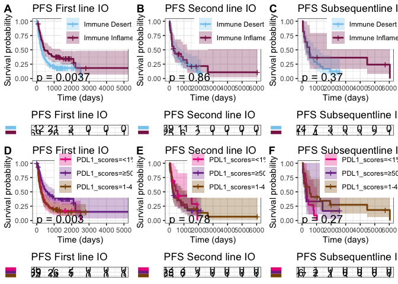

``` r
#ggsave(plot = fig_unsupervised, filename = paste(OUTPUT_DIR,"PFS_Unsupervised.pdf",sep = "/"),width = 16, height = 12)
```

# Associations between TME class, PD-L1 scores and treatment response

``` r
idx = !is.na(survdat$overall_resp) & !is.na(survdat$PDL1_scores)
predicted_combined <- c("R","NR")[as.numeric(as.character(survdat$response_group) == "PD-L1 < 50%, Immune Desert")+1][idx]
predicted_PDL1 <- c("NR","R")[as.numeric(as.character(survdat$PDL1_scores) == "≥50%")+1][idx]
predicted_TME <- c("R","NR")[as.numeric(as.character(survdat$cluster) == "1")+1][idx]
actual <- c("R","NR")[as.numeric(survdat$overall_resp == "NonResponder")+1][idx]

# Associations between TME class and treatment response
precs <- c()
recs <- c()
f1s <- c()
predicted <- predicted_TME
predicted <- factor(predicted, levels = c("R","NR"))
actual <- factor(actual, levels = c("R","NR"))
result <- confusionMatrix(predicted, actual)
precision <- result$byClass['Pos Pred Value']    
recall <- result$byClass['Sensitivity']
F1 <- c(2*(precision*recall)/(precision+recall))
names(F1) <- "F1"
precs <- c(precs, precision)
recs <- c(recs, recall)
f1s <- c(f1s, F1)
rval <- epi.tests(result$table, conf.level = 0.95)
print(rval)
```

    ##           Outcome +    Outcome -      Total
    ## Test +           52           30         82
    ## Test -           66           80        146
    ## Total           118          110        228
    ## 
    ## Point estimates and 95% CIs:
    ## --------------------------------------------------------------
    ## Apparent prevalence *                  0.36 (0.30, 0.43)
    ## True prevalence *                      0.52 (0.45, 0.58)
    ## Sensitivity *                          0.44 (0.35, 0.54)
    ## Specificity *                          0.73 (0.63, 0.81)
    ## Positive predictive value *            0.63 (0.52, 0.74)
    ## Negative predictive value *            0.55 (0.46, 0.63)
    ## Positive likelihood ratio              1.62 (1.12, 2.33)
    ## Negative likelihood ratio              0.77 (0.63, 0.94)
    ## False T+ proportion for true D- *      0.27 (0.19, 0.37)
    ## False T- proportion for true D+ *      0.56 (0.46, 0.65)
    ## False T+ proportion for T+ *           0.37 (0.26, 0.48)
    ## False T- proportion for T- *           0.45 (0.37, 0.54)
    ## Correctly classified proportion *      0.58 (0.51, 0.64)
    ## --------------------------------------------------------------
    ## * Exact CIs

``` r
# Associations between PD-L1 scores and treatment response
precs <- c()
recs <- c()
f1s <- c()
predicted <- predicted_PDL1
predicted <- factor(predicted, levels = c("R","NR"))
actual <- factor(actual, levels = c("R","NR"))
result <- confusionMatrix(predicted, actual)
precision <- result$byClass['Pos Pred Value']    
recall <- result$byClass['Sensitivity']
F1 <- c(2*(precision*recall)/(precision+recall))
names(F1) <- "F1"
precs <- c(precs, precision)
recs <- c(recs, recall)
f1s <- c(f1s, F1)
rval <- epi.tests(result$table, conf.level = 0.95)
print(rval)
```

    ##           Outcome +    Outcome -      Total
    ## Test +           52           31         83
    ## Test -           66           79        145
    ## Total           118          110        228
    ## 
    ## Point estimates and 95% CIs:
    ## --------------------------------------------------------------
    ## Apparent prevalence *                  0.36 (0.30, 0.43)
    ## True prevalence *                      0.52 (0.45, 0.58)
    ## Sensitivity *                          0.44 (0.35, 0.54)
    ## Specificity *                          0.72 (0.62, 0.80)
    ## Positive predictive value *            0.63 (0.51, 0.73)
    ## Negative predictive value *            0.54 (0.46, 0.63)
    ## Positive likelihood ratio              1.56 (1.09, 2.24)
    ## Negative likelihood ratio              0.78 (0.64, 0.95)
    ## False T+ proportion for true D- *      0.28 (0.20, 0.38)
    ## False T- proportion for true D+ *      0.56 (0.46, 0.65)
    ## False T+ proportion for T+ *           0.37 (0.27, 0.49)
    ## False T- proportion for T- *           0.46 (0.37, 0.54)
    ## Correctly classified proportion *      0.57 (0.51, 0.64)
    ## --------------------------------------------------------------
    ## * Exact CIs

``` r
# Associations between combined TME+PD-L1 predictor and treatment response
precs <- c()
recs <- c()
f1s <- c()
predicted <- predicted_combined
predicted <- factor(predicted, levels = c("R","NR"))
actual <- factor(actual, levels = c("R","NR"))
result <- confusionMatrix(predicted, actual)
precision <- result$byClass['Pos Pred Value']    
recall <- result$byClass['Sensitivity']
F1 <- c(2*(precision*recall)/(precision+recall))
names(F1) <- "F1"
precs <- c(precs, precision)
recs <- c(recs, recall)
f1s <- c(f1s, F1)
rval <- epi.tests(result$table, conf.level = 0.95)
print(rval)
```

    ##           Outcome +    Outcome -      Total
    ## Test +           77           48        125
    ## Test -           41           62        103
    ## Total           118          110        228
    ## 
    ## Point estimates and 95% CIs:
    ## --------------------------------------------------------------
    ## Apparent prevalence *                  0.55 (0.48, 0.61)
    ## True prevalence *                      0.52 (0.45, 0.58)
    ## Sensitivity *                          0.65 (0.56, 0.74)
    ## Specificity *                          0.56 (0.47, 0.66)
    ## Positive predictive value *            0.62 (0.52, 0.70)
    ## Negative predictive value *            0.60 (0.50, 0.70)
    ## Positive likelihood ratio              1.50 (1.16, 1.92)
    ## Negative likelihood ratio              0.62 (0.46, 0.83)
    ## False T+ proportion for true D- *      0.44 (0.34, 0.53)
    ## False T- proportion for true D+ *      0.35 (0.26, 0.44)
    ## False T+ proportion for T+ *           0.38 (0.30, 0.48)
    ## False T- proportion for T- *           0.40 (0.30, 0.50)
    ## Correctly classified proportion *      0.61 (0.54, 0.67)
    ## --------------------------------------------------------------
    ## * Exact CIs
