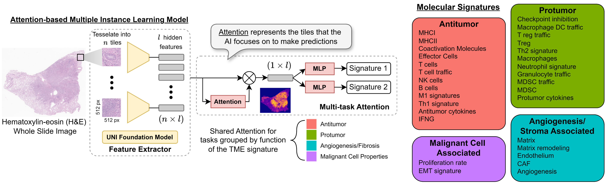
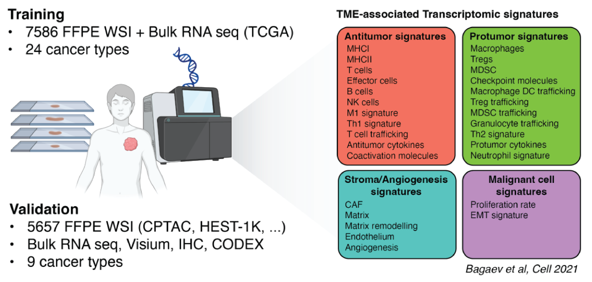
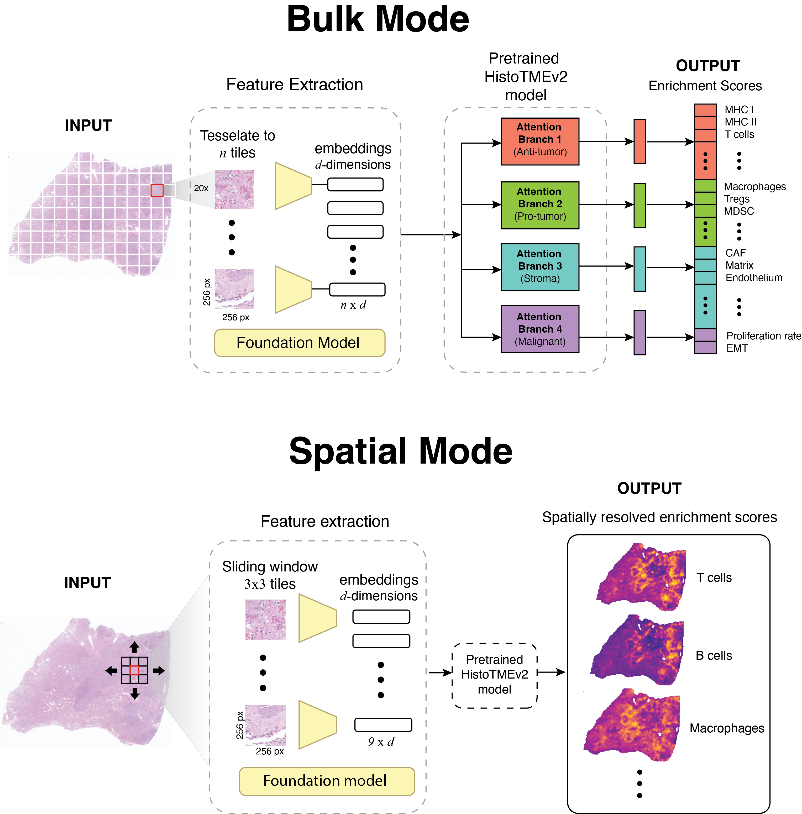

HistoTME
==============



## Overview 
HistoTME is a weakly supervised deep learning framework designed to infer cell type and pathway specific transcriptomic signature activity directly from whole slide H&E images, utilizing digital pathology foundation model feature embeddings. By learning to predict cell type specific and pathway-associated signatures, HistoTME enables comprehensive anlysis of the tumor microenvironment composition from standard H&E pathology slides, without the need for segmentation or classification of individual nucleii. The code in the folder HistoTME_regression can be used to train HistoTME to predict TME signature activity from histopathology slides. The code in the folder HistoTME_downstream provides examples of how HistoTME signature predictions can be utilized for unsupervised clustering analyses of the TME and stratification of cancer patients responses to immunotherapy using H&E image data. The original HistoTME paper is available [here](https://www.nature.com/articles/s41698-024-00765-w).

## Introducing HistoTMEv2 :rocket:
HistoTMEv2 is a pan-cancer extension of HistoTME, trained and tested on 25 different cancer types. See our new preprint [here]()




## Installation and prerequisites
Tested with Python 3.9. Install requirements using:
```
pip install -r requirements.txt
```
Note: the preprocessing script makes use of NVIDIAs cuCIM image processing library. To install cuCIM, see instructions [here](https://github.com/rapidsai/cucim).

## How to use
### Data Preparation
#### Whole slide imaging data
The TCGA and CPTAC whole slide imaging and tanscriptomic data can be found online from [GDC](https://portal.gdc.cancer.gov/), [TCIA](https://wiki.cancerimagingarchive.net/display/Public/CPTAC+Imaging+Proteomics) data portals. The downloaded whole slide images should be stored in a single directory as shown below:
```bash
├── WSI_Directory
│   ├── slide_1.svs
│   ├── slide_2.svs
│   ├── ...
...
...
│   ├── slide_N.svs

```
After downloading the WSI, utilize the scripts provided in the [data_preprocessing](data_preprocessing) folder to tesselate each WSI into non-overlapping tiles and extract foundation model embeddings. Alternatively, you can also use [trident](https://github.com/mahmoodlab/trident) to preprocess your WSI (if they are svs images). The embeddings for each WSI are saved as a h5py file along with the coordinates of each tile:
```
dict{'coords': (x,y), 'features': <embeddings>}
```
Note: Our latest model, HistoTMEv2, tesselates each WSI into tiles of size 256x256 pixels, captured at 20x magnification, in order to facilitate head-to-head benchmarking against other spatial transcriptomic prediction methods. 

#### Transcriptomics data
To calculate ground truth activity of TME-associated signatures from bulk transcriptomics data please see the [following github repository](https://github.com/BostonGene/MFP/blob/master/TME_Classification.ipynb). The ground truth transcriptomic signatures should be saved in a csv file format. See [example_data](example_data).

### Training
we provided updated scripts for training HistoTME in a pan-cancer 5-fold cross-validation fashion:
```
cd HistoTME_regression/
./run_training.sh
```

### Inference
We have provided updated scripts for running inference. Our latest model can now be run in two modes: bulk and spatial. Bulk mode generates enrichment scores for the whole slide or patient. Whereas spatial mode generates tile-level enrichment scores.



After generating tile embeddings with a foundation model you can run the following script to generate bulk signature predictions for a cohort of WSIs
```
cd HistoTME_regression/
python predict_bulk.py [-h] [--h5_folder H5_FOLDER] [--chkpts_dir CHKPTS_DIR] [--cohort COHORT]
                       [--save_loc SAVE_LOC] [--num_workers NUM_WORKERS] [--embed EMBED]

options:
  -h, --help            show this help message and exit
  --h5_folder H5_FOLDER
                        Path to directory containing h5py files
  --chkpts_dir CHKPTS_DIR
                        path to directory where pretrained model checkpoints are saved
  --cohort COHORT       Cohort name
  --save_loc SAVE_LOC   path to where predictions should be saved
  --num_workers NUM_WORKERS
  --embed EMBED         name of foundation model used: [uni, uni2, virchow, virchow2, gigapath, hoptimus0]
```

Alternatively you can also generate spatial resoloved predictions of signatures for a single WSI using the following python script
```
cd HistoTME_regression/
python predict_spatial.py [-h] [--h5_path H5_PATH] [--chkpts_dir CHKPTS_DIR] [--num_workers NUM_WORKERS]
                          [--embed EMBED] [--save_loc SAVE_LOC]

options:
  -h, --help            show this help message and exit
  --h5_path H5_PATH     WSI patch embeddings path for prediction
  --chkpts_dir CHKPTS_DIR
                        path to directory where pretrained model checkpoints are saved
  --num_workers NUM_WORKERS
  --embed EMBED         name of foundation model used: [uni, uni2, virchow, virchow2, gigapath, hoptimus0]
  --save_loc SAVE_LOC

```
### Combining signature predictions generated from multiple foundation models
Our cross-validation results indicate that combining signature predictions generated from several foundation models yeilds the most robust results. To generate ensemble predictions, run the following scripts below. Note: Remember to update the paths to where each foundation model's embeddings are stored prior to running the bash scripts.

For bulk predictions:
```
cd HistoTME_regression/
./run_bulk_ensemble.sh
```

For spatial predictions:
```
cd HistoTME_regression/
./run_spatial_ensemble.sh
```


## Model weights
Pretrained model checkpoints are available on [huggingface](https://huggingface.co/spatkar94/HistoTMEv2). The codes and model weights are intended to be used for research purposes only. Please see the [license](LICENSE)

## Questions and Issues
If you find any bugs or have any questions about this code please contact: [Sushant Patkar](patkar.sushant@nih.gov) or [Alex Chen](alche@sas.upenn.edu)

## Citation
If you found our work useful in your research please consider citing this work as follows: 
```
@article{patkar2024predicting,
  title={Predicting the tumor microenvironment composition and immunotherapy response in non-small cell lung cancer from digital histopathology images},
  author={Patkar, Sushant and Chen, Alex and Basnet, Alina and Bixby, Amber and Rajendran, Rahul and Chernet, Rachel and Faso, Susan and Kumar, Prashanth Ashok and Desai, Devashish and El-Zammar, Ola and others},
  journal={NPJ Precision Oncology},
  volume={8},
  number={1},
  pages={280},
  year={2024},
  publisher={Nature Publishing Group UK London}
}
```

## Acknowledgments
This project was supported by an award from Upstate Foundation's Hendricks Endowment. Data (digital images and clinical meta-data) from the institutional cohort was generated at the Pathology Research Core Lab using institutional resources and support. 

